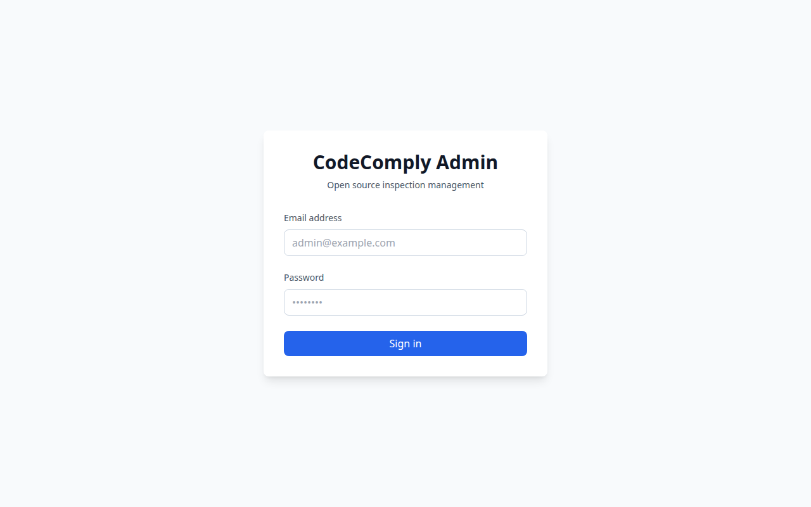
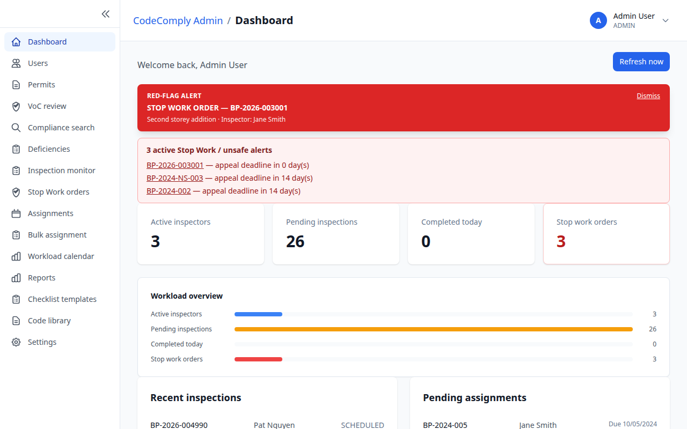
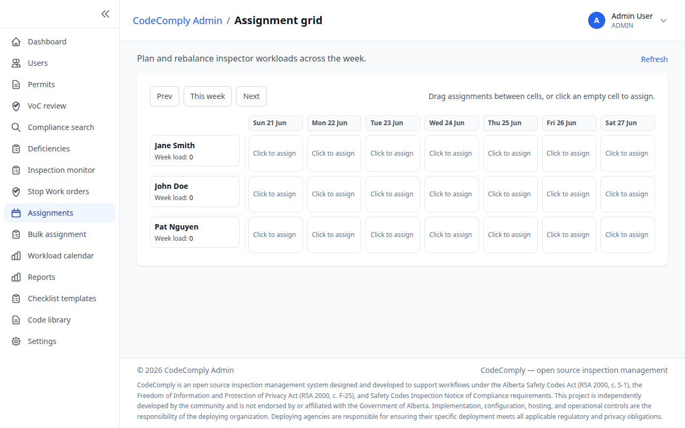
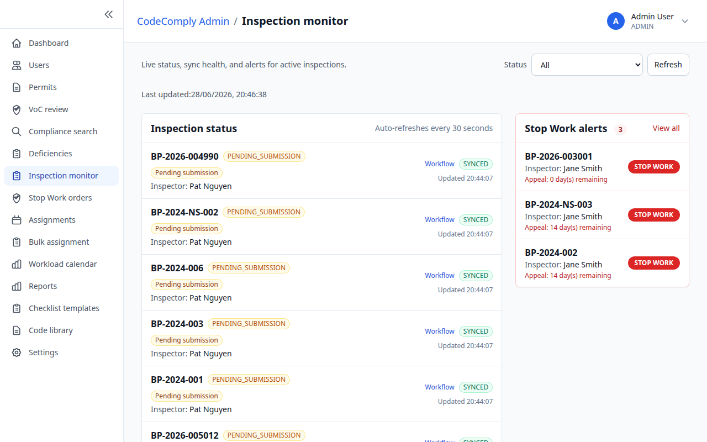
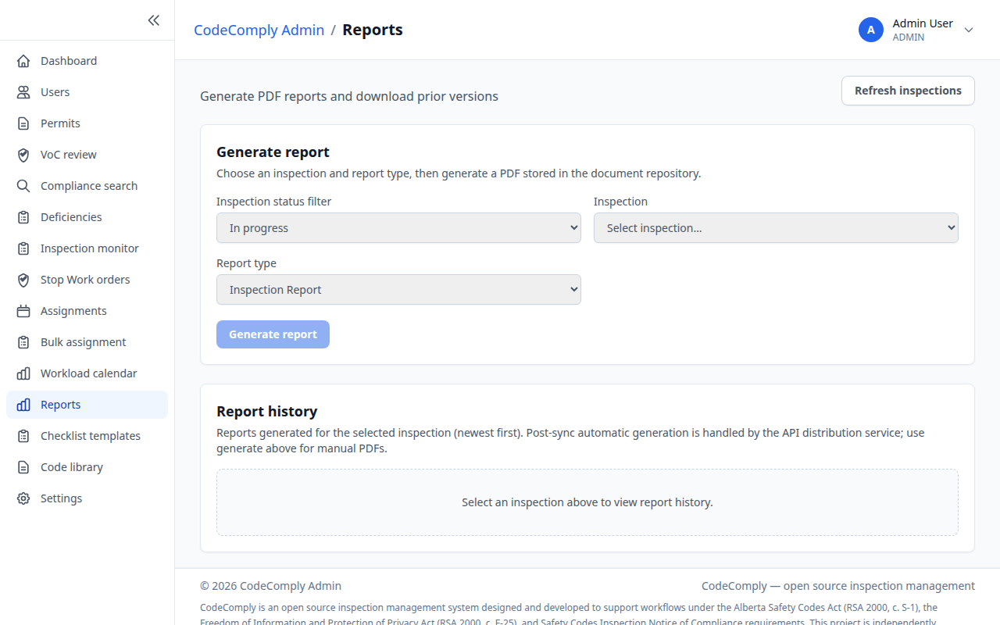

# CodeComply Admin User Guide

End-user guide for **system administrators**, **schedulers**, and **compliance staff** using **CodeComply Admin**—the responsive web application for assignments, monitoring, reporting, and compliance in CodeComply.

For API integration details, see [\_docs/api/README.md](../api/README.md).

---

## Getting Started

### Who this guide is for

Users with **administrator** privileges who manage permits, assignments, users, inspections, reports, and Verification of Compliance (VoC) workflows.

### Access CodeComply Admin

1. Open the **CodeComply Admin** URL in a **desktop or tablet** browser (Chrome, Edge, Firefox, or Safari).
2. Bookmark the URL for daily use—CodeComply Admin requires a **live network** connection.

### Sign in

1. Navigate to **Login** if you are not authenticated.
2. Enter your **email** and **password**, then click **Sign in**.
3. If you see **Access denied**, your account lacks administrator privileges—contact your super-admin.
4. After sign-in, you land on the **Dashboard**.

> **Note:** CodeComply Admin does not support offline operation. Field inspectors use **CodeComply Field** for offline work.

### Main navigation

| Area                   | Purpose                                       |
| ---------------------- | --------------------------------------------- |
| **Dashboard**          | KPIs, recent inspections, pending assignments |
| **Assignments**        | Grid, calendar, and bulk assignment tools     |
| **Users**              | User list and detail (roles, certifications)  |
| **Inspection monitor** | Live status of field inspections and sync     |
| **Reports**            | Generate and download inspection PDFs         |
| **Compliance**         | VoC review queue and compliance search        |
| **Settings**           | Application preferences                       |

---

## Daily Workflow

### Step 1 — Review the dashboard

1. Sign in and review **Dashboard** metrics: open inspections, pending assignments, and recent activity.
2. Click **Refresh** if data appears stale after a network interruption.
3. Use quick links to jump to **Assignments** or **Inspection monitor**.

### Step 2 — Manage assignments

1. Open **Assignments** → **Assignment grid** to see permits and SCO assignments in a table view.
2. Switch to **Workload calendar** for a date-based view of inspector capacity.
3. Use **Bulk assignment** to assign multiple permits in one operation.

### Step 3 — Monitor field inspections

1. Open **Inspections** → **Inspection monitor**.
2. Filter by status, inspector, or date to find in-progress or finalized inspections.
3. Identify inspections with **sync failures** or overdue finalization and follow up with the field SCO.

### Step 4 — Manage users

1. Open **Users** to list all accounts.
2. Click a user to open **User detail**: roles, certifications, and assignment history.
3. Coordinate with IT or super-admins for password resets and access changes.

### Step 5 — Generate reports

1. Open **Reports**.
2. Select an inspection or permit context and choose the report template.
3. Click **Generate**, then **Download** when the PDF is ready.

### Step 6 — Compliance and VoC

1. Open **Compliance** → **VoC review** for pending Verification of Compliance submissions.
2. Review evidence, accept or reject with notes, and track closure.
3. Use **Compliance search** to locate historical inspections, deficiencies, or permit records.

### Step 7 — End-of-day checks

1. Return to **Dashboard** and confirm no critical assignments remain unassigned.
2. Review **Inspection monitor** for inspections stuck in pending sync.
3. Export or archive reports required by your agency’s record-keeping policy.

---

## Offline Usage

CodeComply Admin is **online-only**. It reads live data from the API and does not cache operational workflows for offline use.

### What this means for administrators

- You need a stable **network connection** for all CodeComply Admin tasks.
- Field inspectors work **offline** in **CodeComply Field**; their data appears in CodeComply Admin after **sync**.
- Use **Inspection monitor** to see pending uploads from devices that were offline during the day.

### Monitoring offline field work

1. Open **Inspection monitor** while inspectors are in the field.
2. Status may show **in progress** locally until the device syncs.
3. After inspectors return online, refresh the monitor to see finalized records and uploaded photos.

---

## Troubleshooting

### Cannot sign in

1. Confirm the **CodeComply Admin** URL and that the API is reachable.
2. Verify email and password; use your organization’s password reset process.
3. If you see **Access denied**, request **administrator** role assignment from a super-admin.

### Dashboard shows stale or empty data

1. Click **Refresh** on the Dashboard.
2. Check browser network tools for API errors (401, 503).
3. Sign out and sign in again if your session expired.

### Assignments not appearing for inspectors

1. Confirm the permit is **assigned** to the correct SCO in **Assignment grid**.
2. Ask the inspector to open **Permits** in CodeComply Field while online to trigger assigned sync.
3. Verify the inspector account is active and has the **SCO** role.

### Report generation fails

1. Ensure the inspection is **finalized** and synced from CodeComply Field.
2. Retry after a few seconds—PDF generation may queue on the server.
3. Contact support with the inspection ID if errors persist.

### VoC review items missing

1. Confirm deficiencies were submitted with VoC from the field or admin workflow.
2. Check **Compliance search** by permit or inspection ID.
3. Verify your account has permission to view compliance records.

### Session expired redirect

1. You are returned to **Login** with a session-expired notice.
2. Sign in again; unsaved form work in open tabs may be lost—save frequently.

---

## FAQ

**Q: Can admins use CodeComply Field?**  
A: CodeComply Field is for **SCO** field roles. Admins should use CodeComply Admin unless your deployment explicitly grants dual access.

**Q: How do I reset an inspector’s password?**  
A: Use your organization’s account management process or the **Users** section if self-service reset is enabled.

**Q: Why is an inspection still editable in CodeComply Admin after finalize?**  
A: CodeComply Admin may show server state only after **successful sync** from the device. Check **Inspection monitor** sync status.

**Q: Where are photos stored?**  
A: Photos upload to object storage via the API when inspectors sync. Download links appear in inspection detail and reports.

**Q: Can I use CodeComply Admin on a phone?**  
A: The layout is **responsive**, but complex assignment and report tasks are best on tablet or desktop.

**Q: How do I stay current on API changes?**  
A: See [\_docs/api/README.md](../api/README.md) and the OpenAPI spec at `/swagger` on your deployment.

---

## Related documents

- [API Reference](../api/README.md)
- [CodeComply Field User Guide](./inspector-guide.md)
- [CodeComply Requirements](../requirements/safety-codes-inspection-system-requirements.md)

**Version:** 1.0.0  
**Story:** M11-S23
