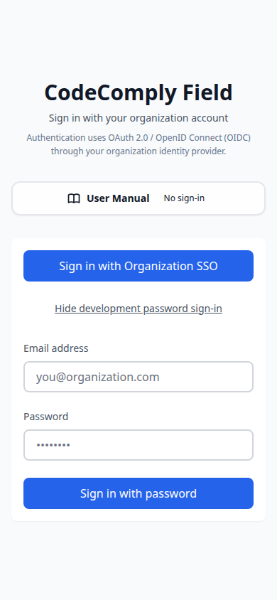
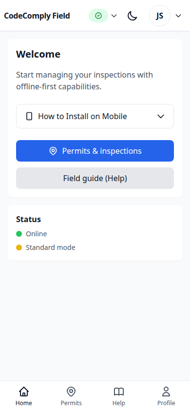
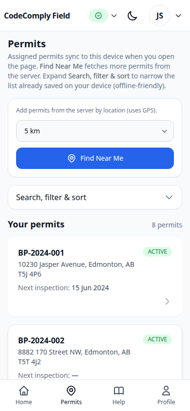
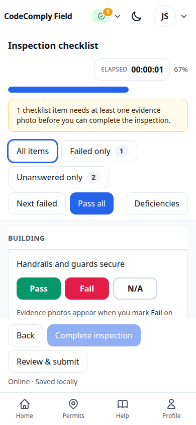
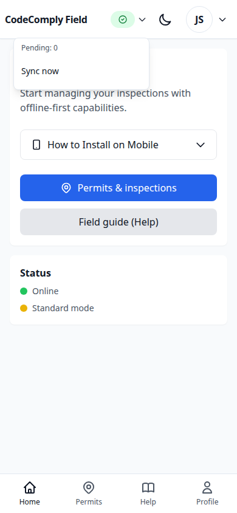

# CodeComply Field User Guide

End-user guide for **Safety Codes Officers (SCOs)** and field inspection staff using **CodeComply Field**—the mobile, offline-first progressive web app (PWA) for CodeComply.

For routing details and milestone alignment, see the companion [CodeComply Field — End-User Workflow](../internal/user-manuals/inspector-app-user-workflow.md).

---

## Getting Started

### Who this guide is for

Certified SCOs and others your organization allows to sign in with the **SCO** role in CodeComply Field.

### Install the app

1. Open the **CodeComply Field** URL in **Chrome**, **Edge**, or **Safari** on your phone or tablet.
2. Tap the browser menu and choose **Add to Home Screen** (iOS: Share → Add to Home Screen).
3. Launch the app from your home screen for the best standalone experience.

### Sign in

1. Open the app. If you are not signed in, you land on **Login**.
2. Enter your **email** and **password**, then tap **Sign in**.
3. Allow **location** when prompted so **Find Near Me** and geofence features work.
4. Confirm your **certifications** on **Profile** after sign-in.

> **Note:** Initial sign-in requires a network connection. The login form is disabled while offline.

### Main navigation

| Area        | Purpose                                                            |
| ----------- | ------------------------------------------------------------------ |
| **Home**    | Shortcuts, offline notice, PWA install hints                       |
| **Permits** | Assigned work, **Find Near Me**, search and filter your saved list |
| **Profile** | Name, certifications, settings                                     |
| **Help**    | In-app help and links to documentation                             |

---

## Daily Workflow

Follow this sequence for a typical on-site inspection.

### Step 1 — Open your assigned permits

1. Tap **Permits** in the bottom navigation.
2. While online, the app syncs permits **assigned to you** from the server.
3. Review the list; use **Search, filter & sort** to find a permit by number or address.

### Step 2 — Review permit details

1. Tap a permit to open **Permit details**.
2. Confirm scope, legal land description, and **scheduled inspections**.
3. Heed any **geofence** warning if you appear far from site coordinates.

### Step 3 — Start or continue an inspection

1. On the relevant scheduled inspection row, tap **Start inspection** or **Continue inspection**.
2. The app opens **Checklist execution** for that inspection.

### Step 4 — Run the checklist

1. For each line, choose **Pass**, **Fail**, or **N/A**.
2. On **Fail**, select a **code reference** (required).
3. Use **Show failed only** and **Pass all** (with confirmation) as needed.
4. Add **photos** on failed lines or where the template requires evidence.

### Step 5 — Record deficiencies

1. After a **Fail**, tap **Record deficiency** to create a deficiency linked to that checklist item.
2. Or tap **Deficiencies** from the checklist header to review, edit, or add deficiencies at the inspection level.
3. Complete description, severity, due date, and any **Stop Work** flags per agency process.

### Step 6 — Review and finalize

1. Tap **Review & submit** from the checklist footer.
2. Resolve validation messages (missing answers, mandatory photos).
3. Choose an **outcome**: Acceptable, Acceptable with conditions, or Refused.
4. Capture your **digital signature**, then tap **Finalize** and confirm.

### Step 7 — Sync your work

1. Open the **sync** menu in the header.
2. Tap **Sync now** when online.
3. Use **Retry failed** if any operations did not upload.
4. After successful finalization sync, the inspection becomes **read-only**.

---

## Offline Usage

CodeComply Field is **offline-first**. You can complete most field work without connectivity.

### What works offline

- Open **saved permits** and permit details cached on the device.
- Run **checklists**, record **deficiencies**, and capture **photos** stored locally.
- **Queue** finalization and other mutations for upload when you reconnect.

### What requires online access

- **Initial sign-in** and token refresh when the session expires (after the configured grace period).
- **Find Near Me** to fetch new permits from the server.
- **Assigned permit sync** when opening Permits for the first time in a session.
- **Photo upload** and server-side finalization (queued locally until sync succeeds).

### Sync best practices

1. Before leaving coverage, tap **Sync now** to push pending work.
2. When back online, open the app and sync again before ending your shift.
3. Watch the header badge for **pending**, **failed**, or **uploading** states.
4. If sync fails repeatedly, note the inspection ID and contact support.

---

## Troubleshooting

### Cannot sign in

1. Confirm you have **network** connectivity (login is disabled offline).
2. Verify email and password; reset through your **administrator** if needed.
3. Ensure your account has the **SCO** role for CodeComply Field.

### GPS or location issues

1. Enable system **location services** for the browser.
2. Move to an open area away from structures that block GPS.
3. Retry **Find Near Me** or restart the app.

### Sync or photo upload stuck

1. Return **online** and open the app.
2. Tap **Sync now**, then **Retry failed**.
3. For large photo batches, wait for upload progress in the header.
4. Free device storage if the app reports offline photo limits.

### PWA install or launch problems

1. Use a supported browser (**Chrome**, **Edge**, or **Safari**).
2. Update the browser to the latest version.
3. Clear cache or free storage, then reinstall to the home screen.

### Voice typing does not work

1. Allow **microphone** permission in browser settings.
2. Use **Chrome**, **Edge**, or **Safari** with an active network for cloud speech.
3. Type the description manually if voice is unavailable.

### Inspection not read-only after finalize

1. Finalization is queued offline—tap **Sync now** until the operation completes on the server.
2. Refresh by navigating away and back to the inspection if status seems stale.

---

## FAQ

**Q: Can I use the app on a desktop?**  
A: Yes, but CodeComply Field is designed for **mobile and tablet** field use. Install when your browser offers it.

**Q: Who can change my password or certification?**  
A: Your **system administrator** through CodeComply Admin.

**Q: What happens if I lose my device?**  
A: Report it immediately so your administrator can revoke access or trigger a remote wipe per policy.

**Q: Can I attach PDF files like photos?**  
A: CodeComply Field’s primary evidence path is **photos**. Arbitrary document uploads may be handled outside this app or in future releases.

**Q: Why does the app warn me about geofence distance?**  
A: It helps confirm you are at the correct site before starting work. Verify the permit address if the warning appears.

**Q: How long can I work offline?**  
A: There is a configured **offline grace period** for navigation after token expiry. Sign in again when prompted.

---

## Related documents

- [CodeComply Field — End-User Workflow](../internal/user-manuals/inspector-app-user-workflow.md)
- [CodeComply Field User Manual](../internal/user-manuals/inspector-user-manual.md)
- [CodeComply Requirements](../requirements/safety-codes-inspection-system-requirements.md)

**Version:** 1.0.0  
**Story:** M11-S23
